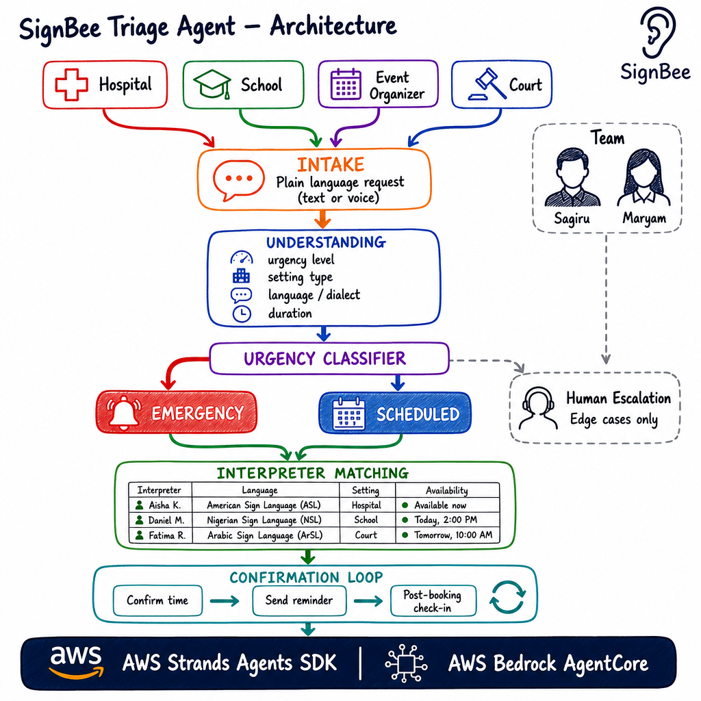

# SignBee Interpreter Triage Agent

> **Agents for Humans Hackathon** · Track: Professional Agents · Built for AWS Strands Agents SDK and Bedrock AgentCore

This repository contains the standalone triage and matching core for SignBee. It is the agent-side companion to the mobile UI in [`SagsMan/SignBEE`](https://github.com/SagsMan/SignBEE).



## Why this repository exists

Hospitals, schools, courts, and event organizers often describe an interpreter need in plain language without knowing which details matter. The SignBee Triage Agent turns that request into a safe, explainable workflow:

1. **Intake** — accept a text request, with voice intake as a future adapter.
2. **Understanding** — extract setting, urgency signals, language/dialect, mode, duration, and location.
3. **Urgency classification** — separate emergency work from scheduled work and route ambiguous hospital requests to a human.
4. **Interpreter matching** — rank qualified interpreters using language, setting experience, availability, and explainable reasons.
5. **Human escalation** — avoid silent guesses when the request is ambiguous, high risk, or has no suitable match.
6. **Confirmation loop** — return confirmation, reminder, and post-booking check-in steps.

The companion SignBEE app now exposes the matching UI flow: request intake, triage state, matched interpreter, monitoring status, and messaging.

## Current implementation

The deterministic Python core in `agent/` runs locally without AWS credentials. It is the safe baseline for tests and demos while the AWS Strands/Bedrock access is being configured. `agent/strands_adapter.py` provides the Strands tool and `agent/agentcore_app.py` provides the Bedrock AgentCore Python runtime entry point.

**Language choice:** the mobile SignBee UI is TypeScript/Expo, but this standalone agent service uses Python because the repository already has a Python layout and the AgentCore deployment resource provides a direct Python runtime pattern. This keeps UI concerns separate from triage orchestration and lets the AgentCore entry point run independently.

The current implementation does **not** claim to be connected to live interpreter availability, production booking, or an AI model until those services are configured. The mock dataset in `data/interpreters.json` is intentionally replaceable.

## Project structure

```text
signbee-triage-agent/
├── agent/
│   ├── main.py                 # CLI entry point
│   ├── models.py               # Request, interpreter, match, and result types
│   ├── intake.py               # Plain-language request understanding
│   ├── classifier.py           # Emergency/scheduled/human-review classification
│   ├── matcher.py              # Explainable interpreter ranking
│   ├── workflow.py             # End-to-end deterministic triage workflow
│   ├── strands_adapter.py      # Strands agent and explainable triage tool
│   ├── agentcore_app.py        # Bedrock AgentCore Python runtime entry point
│   └── tools/                  # Strands tool package boundary
├── data/
│   └── interpreters.json       # Mock interpreter dataset
├── tests/
│   ├── test_emergency.py       # Emergency and escalation scenarios
│   └── test_scheduled.py       # Scheduled matching scenario
├── architecture.png            # Architecture diagram
├── requirements.txt
└── README.md
```

## Setup and local run

```bash
git clone https://github.com/SagsMan/signbee-triage-agent.git
cd signbee-triage-agent
python -m venv .venv
source .venv/bin/activate
pip install -r requirements.txt
python -m unittest discover -s tests -v
```

Run a local request without AWS access:

```bash
python -m agent.main \
  "A patient needs an interpreter urgently in A&E within the hour" \
  --language ASL \
  --mode in-person \
  --location "Lagos hospital"
```

Or run the scheduled school scenario:

```bash
python -m agent.main \
  "A school graduation needs a Nigerian Sign Language interpreter in three weeks" \
  --language NSL \
  --setting school
```

## Agent screen demo

The repository includes a standalone, mobile-first demo of the three SignBee
Agent screens from the companion app:

1. Request intake — choose In-person or Virtual and describe the situation.
2. Matching — show the agent reading, filtering, and ranking the request.
3. Confirmed — show the best match, explain why it was selected, and show the
   SignBee Agent monitoring state.

The UI calls the deterministic triage workflow in this repository, so it can
be demonstrated without AWS credentials:

```bash
python demo_server.py
```

Open `http://127.0.0.1:8000` in a browser. The demo uses the SignBee design
tokens already used by the app (`#1A1340`, `#AAFF00`, and `#E8FFB0`) and keeps
the general SignBEE marketplace screens out of this agent repository.

## Strands and Bedrock AgentCore integration

The backend uses the official Python pattern: a Strands `Agent` is wrapped by `BedrockAgentCoreApp` and exposed through an `@app.entrypoint` function. Install the runtime dependencies and configure AWS through the runtime’s secret manager or environment—not by committing credentials:

```bash
export AWS_REGION=us-east-1
export BEDROCK_MODEL_ID=<model-id-available-in-your-region>
python -c "from agent.strands_adapter import create_strands_agent; print(create_strands_agent())"
python -m agent.agentcore_app
```

Local unit tests do not import AgentCore and continue to run without AWS access. The AgentCore endpoint accepts JSON such as `{"prompt":"A patient needs an interpreter urgently in A&E","mode":"in-person"}` at `/invocations`.

Reference resources:

- [Strands Agents Python AgentCore deployment](https://strandsagents.com/docs/user-guide/deploy/deploy_to_bedrock_agentcore/python/)
- [Strands Agents Amazon Bedrock model provider](https://strandsagents.com/docs/user-guide/concepts/model-providers/amazon-bedrock)

The adapter is intentionally narrow. The agent should call the triage tool, preserve the structured result, explain match reasons, and escalate instead of inventing availability. A future runtime integration can replace the local matcher with authenticated SignBee booking and interpreter services.

## Safety and escalation rules

- Emergency language is surfaced explicitly; it is not hidden behind a score.
- Ambiguous hospital requests require human confirmation.
- Missing language or no suitable match is visible in the result.
- Match results include reasons so a coordinator can inspect the recommendation.
- Mock availability is not production availability.
- No AWS credentials, API keys, or personal data belong in this repository.

## Credits

- **Maryam** — UI/UX Designer for both the SignBee app and SignBee Agent
- **Sagiru** — Developer

## Team

- **Sagiru Garba** — Development / implementation
- **Maryam Bola** — Product / agent design

## License

MIT — see [LICENSE](LICENSE).

Built for the Agents for Humans Hackathon · Submissions close September 14, 2026.


<!-- signbee-agent-interface -->
## SignBee Agent interface

The SignBee Agent is the client-facing request and triage flow for connecting people with a qualified human interpreter, whether the request is in-person or virtual. The complete reference gallery below mirrors the screens supplied for the Agent interface.

[Open the SignBee Agent Figma design](https://www.figma.com/design/jlwNxDyjd8rrAq3O1Poxrh/SignBee--Copy-?node-id=508-375&t=FBDmQw7TI4QPlodH-0)

### Complete interface reference

\n\n\n\n\n\n\n\n\n\n\n\n\n\n\n\n\n\n\n\n\n\n\n\n\n\n\n\n\n\n

### Frontend and backend direction

- **Frontend:** React Native with Expo Go for the mobile client.
- **Backend:** Keep the existing Python triage and matching service.
- **Boundary:** The mobile app will call the Python service for intake, triage, matching, and status updates.
