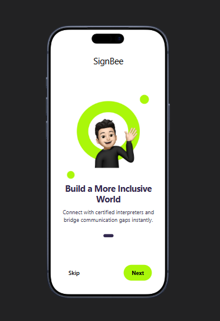
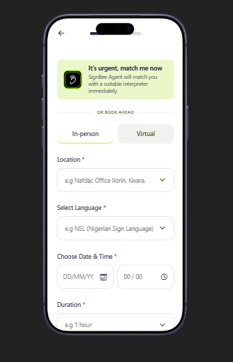
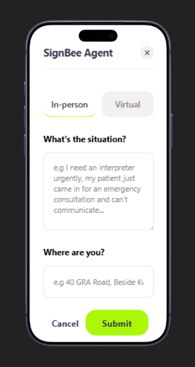
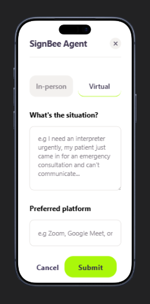
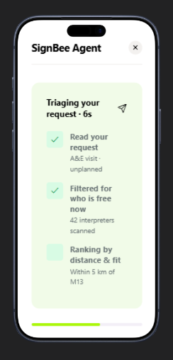
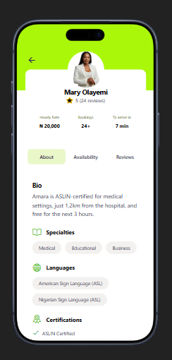
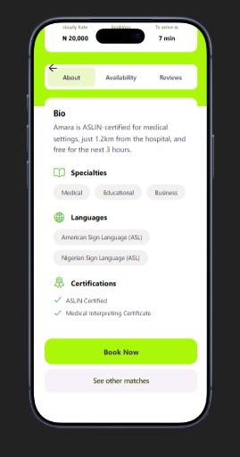
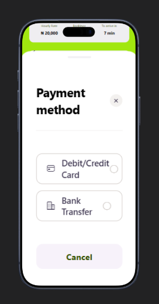
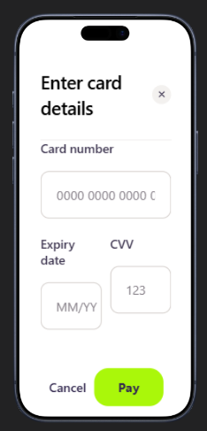
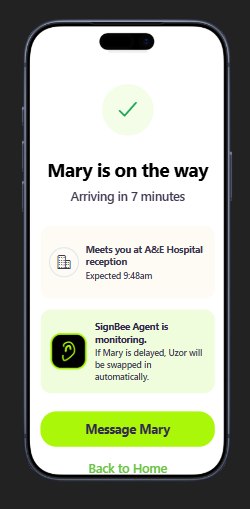

# SignBee Interpreter Triage Agent

SignBee is a React Native/Expo mobile client with a Python interpreter-triage
backend. The app supports urgent and scheduled interpreter requests, explains
why a match was selected, and keeps ambiguous requests visible for human
review.

## App screenshots

The following screenshots show the SignBee onboarding, booking, virtual and
in-person request flows, and triage experience:

| Onboarding | Urgent request |
|---|---|
|  |  |

| In-person request | Virtual request |
|---|---|
|  |  |

| Triage progress | Screen 06 |
|---|---|
|  |  |

| Screen 07 | Screen 08 |
|---|---|
|  |  |

| Screen 09 | Screen 10 |
|---|---|
|  |  |

## Requirements

- Node.js 20 or newer
- npm 10 or newer
- Python 3.10 or newer
- Expo Go for device testing
- Android Studio and an Android SDK for Android native builds
- macOS, Xcode, and CocoaPods for iOS native builds

Confirm that Node.js and npm are available:

```bash
node --version
npm --version
```

## Install the project

```bash
git clone https://github.com/SagsMan/signbee-triage-agent.git
cd signbee-triage-agent
npm install
```

Set up the Python service in a separate virtual environment:

```bash
python3 -m venv .venv
source .venv/bin/activate
python -m pip install --upgrade pip
python -m pip install -r requirements.txt
```

On Windows PowerShell, activate the environment with:

```powershell
.venv\Scripts\Activate.ps1
```

## Run the mobile app

Start the Expo development server:

```bash
npm start
```

Then:

1. Install **Expo Go** on the Android or iOS device.
2. Connect the device and computer to the same Wi-Fi network.
3. Scan the QR code shown by Expo Go, or press `a` for an Android emulator or
   `i` for an iOS simulator.

Useful commands:

```bash
npm run start:tunnel  # Use a public tunnel when the device cannot reach the computer
npm run android       # Open the project in an Android emulator
npm run ios           # Open the project in an iOS simulator
npm run web           # Run the web version
npm run typecheck     # Check TypeScript without emitting files
```

The Expo tunnel uses ngrok. If Expo reports that ngrok needs authentication,
install the ngrok CLI, add your own ngrok authtoken locally, and run
`npm run start:tunnel` again. Never commit the token to this repository.

## Run the Python triage service

Run the tests:

```bash
source .venv/bin/activate
python -m unittest discover -s tests -v
```

Start the local demo API:

```bash
source .venv/bin/activate
python demo_server.py
```

The demo server listens on `http://127.0.0.1:8000` and exposes
`POST /api/triage`. The Expo client and Python service are started
independently.

Run a request directly through the CLI:

```bash
python -m agent.main \
  "A patient needs an interpreter urgently in A&E within the hour" \
  --language ASL \
  --mode in-person \
  --location "Lagos hospital"
```

## Generate an Android APK

Expo Go is for development. To create a native Android build, install Android
Studio, the Android SDK, and a compatible JDK, then generate the native Android
project:

```bash
npx expo prebuild --platform android
```

Build a release APK:

```bash
cd android
./gradlew assembleRelease
```

On Windows, run `gradlew.bat assembleRelease` instead. The APK is written to:

```text
android/app/build/outputs/apk/release/app-release.apk
```

For a distributable signed APK, configure an Android release keystore through
Gradle/Android Studio. Keep the keystore and its passwords outside the
repository. A debug APK can be built with `./gradlew assembleDebug`.

## Build the iOS app

iOS does not use APK files. The equivalent installable artifact is an `.ipa`,
and Apple signing is required for a physical device or distribution build.
iOS builds require macOS and Xcode.

Generate the native iOS project and install its CocoaPods dependencies:

```bash
npx expo prebuild --platform ios
cd ios
pod install
cd ..
```

Run a Release build on the simulator or a connected development device:

```bash
npx expo run:ios --configuration Release
```

To create an `.ipa`, open the generated workspace in Xcode:

```bash
open ios/*.xcworkspace
```

In Xcode, select the app target, configure the Apple Developer team and
signing profile, then choose **Product → Archive**. From the Organizer, choose
**Distribute App** and export the signed `.ipa` or submit it through the
appropriate Apple distribution channel.

Native `android/` and `ios/` directories are generated by `expo prebuild`.
Keep them committed only if the project is moving to a maintained native
workflow; otherwise remove the generated directories after local builds.

## Project structure

```text
signbee-triage-agent/
├── app/                 # Expo Router screens
├── assets/images/       # SignBee branding and profile assets
├── components/          # Shared React Native components
├── agent/               # Triage, classification, and matching logic
├── data/                # Local mock interpreter dataset
├── tests/               # Python backend tests
├── app.json             # Expo configuration
├── demo_server.py       # Local Python API server
├── package.json         # Expo scripts and dependencies
└── requirements.txt     # Python dependencies
```

## Safety and data notes

- The included interpreter data is mock data and is not live availability.
- The demo service does not provide production booking or authentication.
- Do not commit AWS credentials, API keys, ngrok tokens, signing keys, or
  personal data.

## Project credits

- **Maryam** — UI/UX Designer
- **Sagiru** — Developer